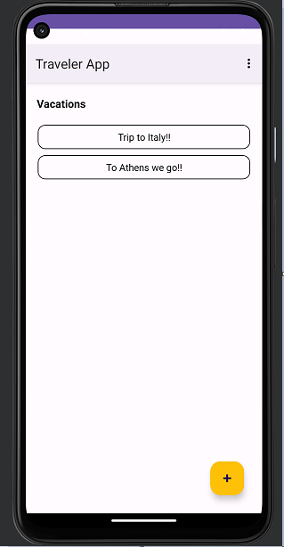

# Traveler App - Vacation and Excursion Management App

## Introduction
Traveler App is a mobile application designed to help users manage their vacations and excursions efficiently. With Traveler App, users can easily organize their travel plans, view vacation details, add new vacations and excursions, and keep track of all their travel adventures in one place.

This app is developed using Java and Android SDK, utilizing the Room Persistence Library for local database management and RecyclerView to display lists of vacations and excursions. The user interface is designed to be intuitive and user-friendly, providing a seamless experience for managing travel plans.

## Features
- **Vacation Management:** Add, view, update, and delete vacations with ease.
- **Excursion Tracking:** Plan excursions for each vacation and keep track of important details.
- **Notifications:** Set reminders for excursions to never miss any adventure.
- **Data Persistence:** Utilize the Room Persistence Library to store vacation and excursion data locally.
- **Responsive Design:** Enjoy a responsive and visually appealing user interface across different devices.

## Getting Started
To get started with Traveler App, follow these steps:

1. Clone the repository to your local machine.
2. Open the project in Android Studio.
3. Build and run the app on an Android emulator or physical device.

## Dependencies
Traveler App uses the following major dependencies:

- Room Persistence Library: To manage local database operations.
- RecyclerView: To display lists of vacations and excursions efficiently.
- AndroidX: To support modern Android features and components.
- Google Material Components: To create a visually appealing user interface.
- Android Support Libraries: To ensure compatibility with older devices.

For a complete list of dependencies, check the `build.gradle` file.

## Contributing
Contributions to Traveler App are welcome! If you find any bugs or have suggestions for new features, please feel free to open an issue or submit a pull request.

## APK Key
Password Western123
Signed to version 1.0